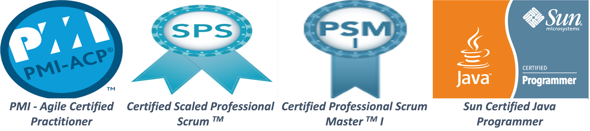

## [Muhammad Faisal](https://au.linkedin.com/in/muhammadfaisal2)

I believe that I am the best fit for the Java related roles like `Senior Software Engineer/Tech Lead/Engineering Manager`. 

Why? Some of the reasons are given below:

* I am seasoned Agile developer (Lead Delivery Engineer) as well as Scrum Master and very comfortable with the principle of iterative development.
* I am delivery-oriented person, understand the sprint as well as overall projects goals and can easily keep the team focused on achieving those goals.
* My ability to delegate responsibility and effectively present ideas has allowed me to be very successful in what I do, resulting in strong reputation for professionalism.
* I am a proven technical leader who is able to inspire an engineering team, bring clarity to their work, and help drive them to execute to the best of their abilities.
* I have good decision-making, problem solving, and implementation skills and am continuously looking for ways to improve engineering quality.
* I’ll be happy to speak up as soon as I notice that the team is going off track.
* I have proven track record of delivering “working” software rather than just software as part of each iteration/sprint.
* I’ve been able to achieve this all the time by focusing on the quality of deliverable, i.e. by having enough automated tests in the form of unit, integration, performance, security as well as acceptance tests, hence code changes/refactoring/bug fixing can be done much quicker and with confidence.
* Through TDD, I am able to think well about the system and can forecast future issues easily.
* I am very much comfortable with CI (continuous integration) and CD (continuous delivery as well as deployment) principles.
* I play important role in the estimation as well as iteration planning meetings (IPMs) by finding out the dependencies, breaking out the complex/bigger problems into smaller more manageable problems and making the stories in a way to be able to play them in parallel if possible. Also, ensure that the stories are testable in themselves.
* I am more on the side of writing clean, simple and readable code to avoid the need of documentation most of the time.
* I think about how the reliability, scalability and availability of the offered solutions be enhanced, for example, mechanisms like proper time-outs, rate limiting, throttling, circuit breakers etc. can really help in such cases.
* I am always happy to take more responsibility whenever required and can step back as well to give chance to other team members.
* I am always open to collaborate and communicate with UX/QA/BA/Dev (any stakeholder) to discuss the requirements, solution, test scenarios, risks etc., which really helps to have every one in the team on the same page.
* I am an expert in balancing multiple priorities on large-scale, high-visibility projects and employing techniques to deal with ambiguity.
* I have the ability to challenge and remove any unnecessary barriers to service delivery.
* I am really strong in coaching and mentoring multi-disciplinary teams in Agile’s best practices/techniques, as well as suggesting automation to increase productivity.
* Strong negotiation skills and the proven ability to influence external partners, stakeholders and customers to secure mutually beneficial outcomes.
* I am a collaborative team player, and lead a professional scrum team as part of a wider group of scrum masters working towards common goals within a large-scale programme.

I’ve been doing all of the above and more in my day-to-day life. More importantly, I do not follow these practices just because I am instructed to do so, rather I follow them cause I can see some real value and importance of them. I also strongly believe that to get the real value out of anything, one should first understand the importance rather than blindly following (e.g. Mechanical Scrum vs. Professional Scrum), and then he/she can use that practice/principle with passion.
