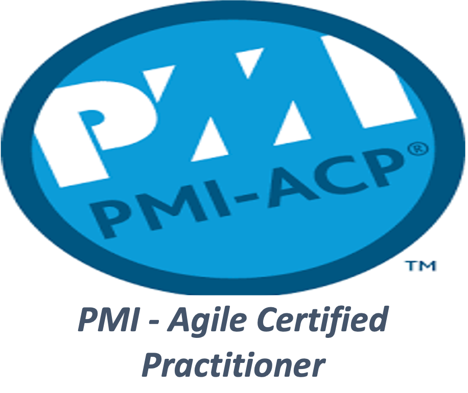
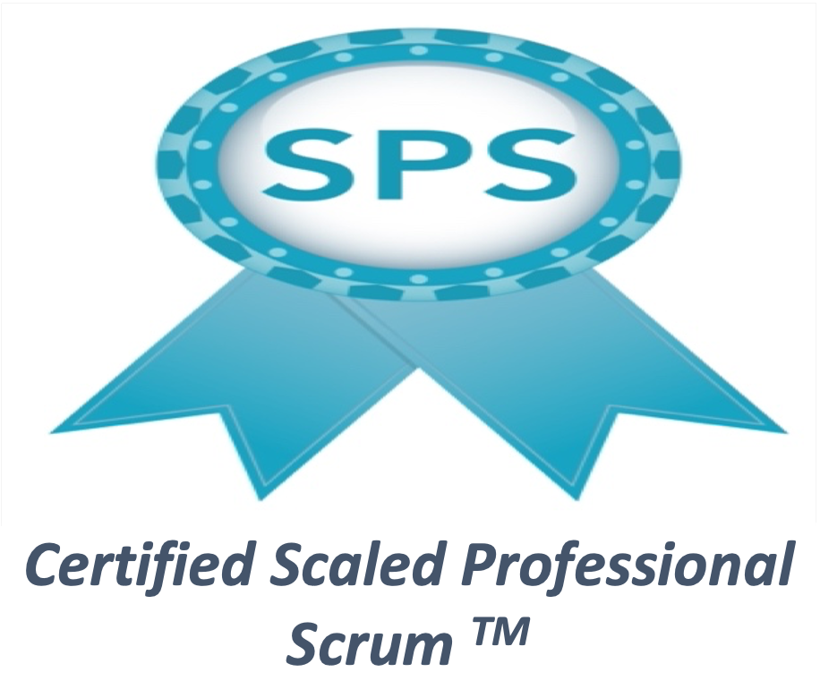

## [Muhammad Faisal](https://au.linkedin.com/in/muhammadfaisal2)

Hi, its Faisal here, having around 15 years of solid experience working mainly on enterprise level projects. 

I have been working mostly on the development of distributed systems, where I have to work across the whole stack 
including frontend, backend, infrastructure setup, setup up CI/CD etc.

I believe that I am the best fit for the Java related roles like **Senior Software Engineer/Tech Lead/Engineering Manager**. 

Why? Some of the reasons are given below:

* I am seasoned Agile developer (Lead Delivery Engineer) as well as Scrum Master and very comfortable with the 
principle of **iterative development**.
* I am **delivery-oriented** person, understand the sprint as well as overall projects goals and can easily keep the 
team focused on achieving those goals.
* My ability to delegate responsibility and **effectively present ideas** has allowed me to be very successful 
in what I do, resulting in strong reputation for professionalism.
* I am a proven technical leader who is able to **inspire an engineering team**, bring clarity to their work, 
and help drive them to execute to the best of their abilities.
* I have good decision-making, problem solving, and implementation skills and am continuously looking for ways to 
improve engineering quality.
* I’ll be happy to speak up as soon as I notice that the team is going off track.
* I have proven track record of **delivering “working” software** rather than just software as part of each iteration/sprint.
* I’ve been able to achieve this all the time by focusing on the **quality of deliverable**, i.e. by 
having **enough automated tests** in the form of **unit, integration, performance, security as well as acceptance tests**, 
hence code changes/refactoring/bug fixing can be done much quicker and with confidence.
* Through **TDD**, I am able to think well about the system and can forecast future issues easily.
* I am very much comfortable with **CI (continuous integration)** and **CD (continuous delivery as well as deployment)** principles.
* I play important role in the **estimation** as well as **iteration planning meetings (IPMs)** by finding out the 
dependencies, **breaking out** the complex/bigger problems into **smaller more manageable problems** and making the 
stories in a way to be able to **play them in parallel** if possible. Also, ensure that the **stories are testable** in themselves.
* I am more on the side of writing **clean, simple and readable code** to avoid the need of documentation most of the time.
* I think about how the **reliability, scalability and availability** of the offered solutions be enhanced, for example, 
mechanisms like proper **time-outs, rate limiting, throttling, circuit breakers** etc. can really help in such cases.
* I am always happy to **take more responsibility** whenever required and can step back as well to give chance to other team members.
* I am always **open to collaborate and communicate** with UX/QA/BA/Dev (any stakeholder) to discuss the requirements, 
solution, test scenarios, risks etc., which really helps to have every one in the team on the same page.
* I am an expert in **balancing multiple priorities** on large-scale, high-visibility projects and employing techniques 
to deal with ambiguity.
* I have the ability to challenge and remove any **unnecessary barriers** to service delivery.
* I am really strong in **coaching and mentoring** multi-disciplinary teams in **Agile’s best practices/techniques**, 
as well as suggesting **automation to increase productivity**.
* Strong negotiation skills and the proven ability to influence external partners, stakeholders and customers to 
secure mutually beneficial outcomes.
* I am a **collaborative team player**, and lead a professional scrum team as part of a wider group of scrum masters 
working towards common goals within a large-scale programme.

I’ve been doing all of the above and more in my day-to-day life. More importantly, I do not follow these practices 
just because I am instructed to do so, rather I follow them cause I can see some real value and importance of them. 
I also strongly believe that to get the real value out of anything, one should first understand the importance rather 
than blindly following (e.g., **Mechanical Scrum vs. Professional Scrum**), and then he/she can use that 
practice/principle with passion.

## Organizations I have worked for
* [Atlassian][atlassian-url]
* [Vodafone Hutchison Australia][vha-url]
* [National Broadband Network (NBN) Co, Australia][nbn-url]
* [Department of Immigration and Citizenship (DIAC), Australia][diac-url]
* [IBM Global Services, Australia][ibm-url]
* [DiUS Consulting, Australia][dius-url]
* [ResMed, Australia][resmed-url]
* [NetSol Technologies Inc.][netsol-url]

## FAQs

### Briefly describe your career history

I’ve been in the software industry for last 15 years. Apart from technical skills, 
I’m certified professional Scrum master, scaled professional scrum as well as certified Agile practitioner from PMI. 
I’ve worked across different domains like land management, visa processing, healthcare, telecom etc. 
It’s been a steep learning curve where I just did not learn but also shared what I learnt whenever I got the opportunity.

I’ve started my career as Software Engineer and since then, had been playing different roles. 
My cost effective solutions with high quality deliverables as well as delivery oriented track record
got rewarded with the career progression such as, leading the team and project, or becoming the 
Software Engineering Manager (as they knew that I’ve never been scared to take up bigger challenges).

There had been tight deadlines, challenging requirements and complex issues from time to time, but have been meeting 
the expectations through the use of tools like communication, transparency, staying calm even
under huge load and pressure; and then, “the approach” towards development and delivery, which means, 
follow the divide and conquer technique to split the complicated problems into small, measurable, achievable, 
testable and manageable ones, and follow Moscow technique to prioritise them to ensure delivering the best value all the time.

Apart from that, I’ve also been focusing on looking for opportunities for automation which could either be project 
related or process related as well.

### What have I been doing after Atlassian? (Career Break)

I finished with Atlassian in 2021 and below are some details related to the gap/break since then. 

I went on a normal couple of months holiday in February 2021, but then some unfortunate series of events kept happening at sort of regular intervals which forced me to keep prolonging my stay to take care of family overseas. Apart from other family related responsibilities, I also helped my brother setting up his property business. 

I had a personal project developed with Java 10 and springboot 2.0.5, which I upgraded last year to Java 20 and springboot 3.1.2 release. There were lot of other components and libraries which got upgraded as part of that major upgrade. 

I also joined some IT/software related groups with the intention to help/answers others. I see it as another way of learning too.

### Tell me about a time when you needed to get things done without direction or supervision?

There had been quite a few examples but I’ll use the implementation of API Gateway as an example. Problem was, 
our B2B gateway at that time was facing issues including long downtimes, which was not acceptable at all. 
So I was tasked to come up with the plan along with a Proof of Concept to have our own API Gateway. 
No further direction or supervision was there as that’s all I was told. So, I did some research and shortlisted an 
off the shelf product named Tyk which I could use to build my gateway on top of that instead of reinventing the wheel. 
It was developed in house to avoid purchasing expensive product from the market. So, I developed a proof of concept 
and started thinking about productionising it and that’s when I introduced tools like docker, ansible, vagrant, 
packer, nginx, log rotation etc. After having bits and pieces connected together, presented the whole solution to the
platform head, the approach as well as the PoC was well received and as a result, I was given a team to work on it 
properly and make it production ready. Got the team up to speed and they got the opportunity to learn tools 
like ansible, docker, etc. It was deployed on AWS with all the latest techniques like scaling, load balancing etc.
at that time. The project later became a product in the organisation and got used by multiple teams.

### Tell me about a time where you had conflicting deadlines, what did you do?

We usually work on projects and the timeline is always sort of packed with tasks or stories. Its just one of such 
project we were working on, when we out system got attacked by hackers. So, security definitely has got higher priority 
than whatever else is in development. To tackle that, we had to work extra hours but still had to cut some corners 
from out next project. Also had to reprioritise to ensure that the best value will get delivered by the end of the 
project and within the timeline. That’s what had happened, but in general, conflicting deadlines can be almost avoid 
with the right level of communication, transparency and dependency management. So that, in most of the cases, 
no one else is waiting for the work to be delivered by someone else. It’s all about keep unlocking others before 
the other get to that stage. So, I’d say its about having the right culture and discipline in the organisation. 
Sure, that won’t eliminate the conflicts 100% but you’ll see that they can be avoided in most of the cases.

<!-- MARKDOWN LINKS & IMAGES -->
<!-- https://www.markdownguide.org/basic-syntax/#reference-style-links -->
[atlassian-url]:https://www.atlassian.com/
[vha-url]:https://www.vodafone.com.au/
[nbn-url]:https://www.nbnco.com.au/
[diac-url]:https://www.homeaffairs.gov.au/
[ibm-url]:https://www.ibm.com/au-en
[dius-url]:https://dius.com.au/
[resmed-url]:https://www.resmed.com.au/
[netsol-url]:https://www.netsolpk.com/
